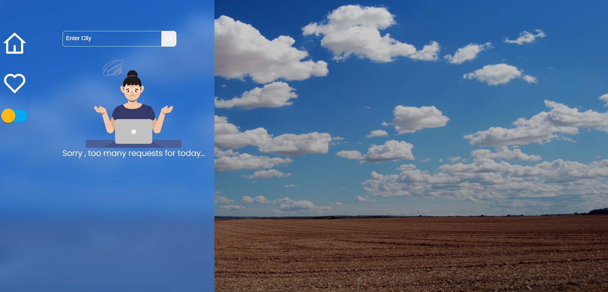
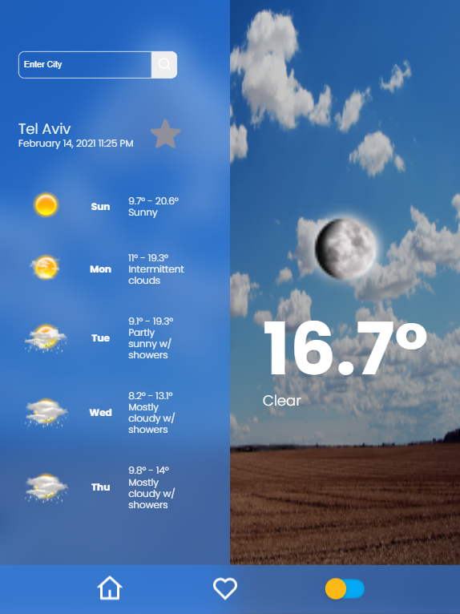
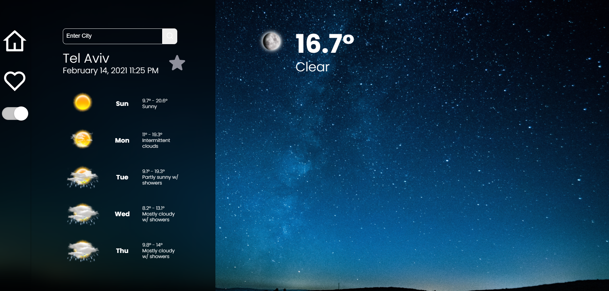
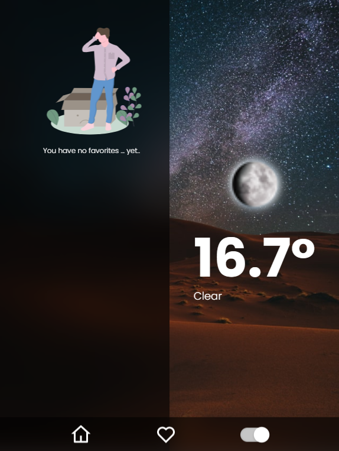
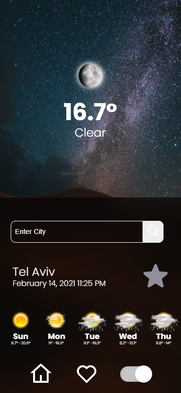

# Weather App

Weather app is an easy to use app that aloow us to searce for the weather in a specific city, and add to favorites.

# Table Of Contents

- [Kelev-App](#kelev-app)
  - [Screenshots](#screenshots)
    - [Weather Screen](#first-screen)
    - [favorites](#favorites)
    - [responsive](#responsive)
    - [Dark Mode](#Dark-Mode)
  - [Techstack](#tech-stack)
  - [TODO](#todo)

## Screenshots

### Weather Screen

When the user opens the app for the fist time, by default he gets weather information related to telaviv.

### favorites

A user can click on the start next to the city and add it to the favorites

### responsive

We can find this app responsive across all of the relevant platforms (desktop, laptop , ipad pro, ipad & mobile)

### Dark Mode 

The user can toggle between night and dark mode

## Techstack

- React with Redux & Thunk.
- Design with sass.
- Accuweather API for weather.
- NodeJS.
- React lottie for animations.
- Dayjs for date formatting.

