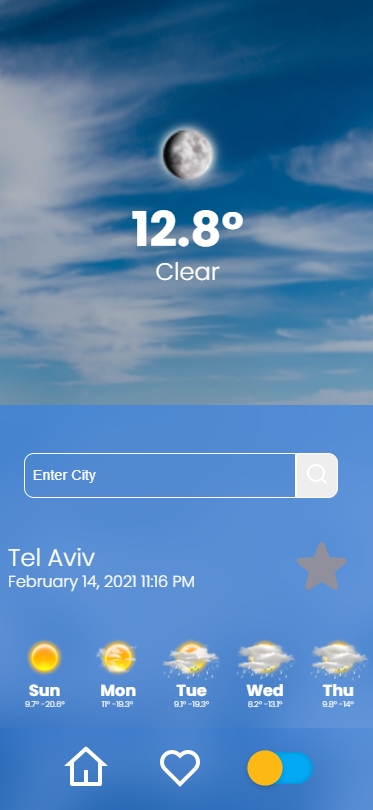

# Kelev-App

Kelev-App is a social network app that connects dog owners , dogs and dog-parks. 

# Table Of Contents

- [Kelev-App](#kelev-app)
  - [Screenshots](#screenshots)
    - [Weather Screen](#first-screen)
    - [favorites](#favorites)
    - [responsive](#responsive)
    - [Dark Mode](#Dark-Mode)
  - [Techstack](#tech-stack)
  - [TODO](#todo)

## Screenshots

### Weather Screen

When the user opens the app for the fist time, by default he gets weather information related to telaviv.

### favorites

A user can click on the start next to the city and add it to the favorites

### responsive

As a user clicks on a pop-up of a certain dog-park , the app provides him with the inforamtion of who is currently at the park, who's on its way, park ameneties as well as park pics & rating. 

### Dark Mode 

The user page contains menu where he can access his dogs page , and see the upcomig features. When he clicks on a profile he can see a list of his dogs and have the ability to choose with which of the dogs he is going to the park.

A user can add new dog to his list or edit the dog's details if needed.

## Techstack

- React with Redux & Thunk.
- Design with sass.
- Accuweather API for weather.
- NodeJS.
- React lottie for animations.
- Dayjs for date formatting.

